const logs = await FileAttachment("weekend-logs.json").json();

## Agenda

- Motivation

- Modeling

  - Theory and Implementation

  - Validation and Benchmarking

- Design Optimization: Cost

  - Systems Formulation

  - Results

- Design Optimization: Economic and Environmental Value

  - Metrics and Formulation

  - Preliminary Results

- Conclusion

# Motivation

::: frame
## Agenda

- **Motivation**

- Modeling

  - Theory and Implementation

  - Validation and Benchmarking

- Design Optimization: Cost

  - Systems Formulation

  - Results

- Design Optimization: Economic and Environmental Value

  - Metrics and Formulation

  - Preliminary Results

- Conclusion
:::

::: frame
## Wave Energy Converters (WECs)

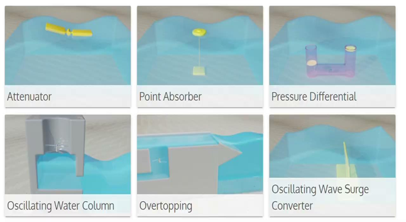{width="90%"}

PRIMRE - National Renewable Energy Laboratory
:::

::: frame
## Motivation: Wave Energy

Relevance to the grid:

- Seasonal profile

- Predictability and daily profile

- Resource diversity

Relevance for off-grid projects:

- Offshore co-location

- Smaller scale

- Other resources not viable

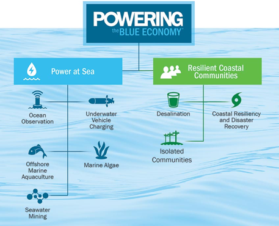{width="90%"}

U.S. Department of Energy
:::

::: frame
## Motivation: Bottlenecks

- Goal: use early-stage design optimization to inform which WEC design
  is most viable

- Low funding

- Few ocean deployments

- High device costs

- Optimization

- Value metrics

- Alternative markets

- High device costs

- Value metrics

- Optimization

- Adapted from Caio et al. 2019
:::

::: frame
## Systems Design

We want a simulation and optimization framework that is:

- interdisciplinary

- fast

- accurate

- reproducible

- informative
:::

# Modeling

::: frame
## Agenda

- Motivation

- **Modeling**

  - Theory and Implementation

  - Validation and Benchmarking

- Design Optimization: Cost

  - Systems Formulation

  - Results

- Design Optimization: Economic and Environmental Value

  - Metrics and Formulation

  - Preliminary Results

- Conclusion
:::

::: frame
## Models of varying complexity

{width="90%"}

- Algebraic

- Linear PDE

- Nonlinear ODE

- Linear PDE

- Algebraic
:::

::: frame
## Methods for Solving a PDE

- Chosen methods

- Semi-analytical: dynamics, hydrodynamics

- Analytical: structures

- Steps for each model

- Development

- Synthesis

- Validation

- Benchmarking

- Accuracy

- Compute time

- Algebraic/Lumped

- Numerical Linear

- Numerical Nonlinear

- (Semi-) Analytical
:::

::: frame
## Hydrodynamics: Matched Eigenfunction Expansion Method

- Open-source Python toolbox: OpenFLASH

  Geometry             Mathematical development       Open-source implementation
  -------------------- ------------------------------ -------------------------------
  Simple cylinder      Yeung 1980                     McCabe, Khanal, and Haji 2024
  N-cylinder           Kokkinowrachos 1986            Best et. al 2025 (in review)
  Slanted N-cylinder   McCabe et. al 2026 (in prep)   McCabe et. al 2026 (in prep)
:::

::: frame
## Dynamics: Implicit Multidisciplinary Feasible

{width="\\linewidth"}
:::

::: frame
## Dynamics: Nonlinearities with Describing Functions

- Approximate the non-sinusoidal signal with its fundamental amplitude

{width="60%"}
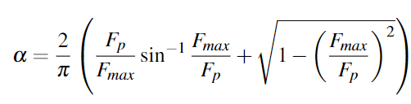{width="40%"}

McCabe, Murphy, and Haji, 2022.
:::

::: frame
## Dynamics: Linear Multiport Model

- Powertrain kinematics and dynamics

- Underactuated (fewer actuators than degrees of freedom)

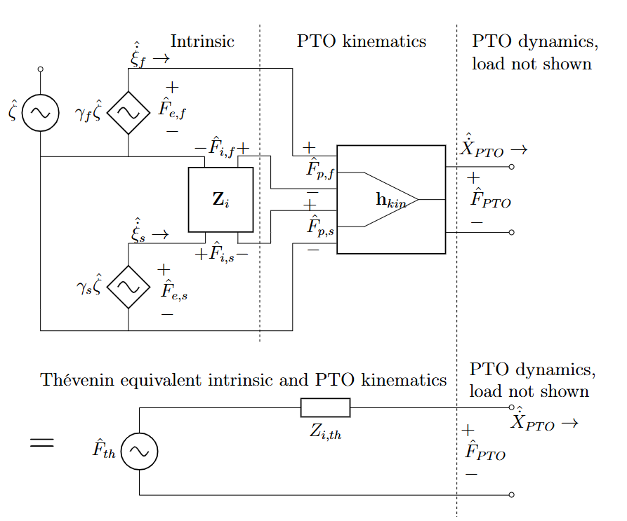{width="70%"}
:::

::: frame
## Controls: Linearized Pseudo-Spectral Method

- Incorporate time-domain constraints with collocation

- Apply describing function linearization

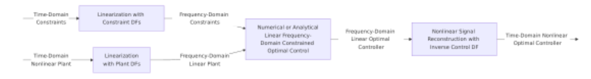{width="50%"}

McCabe, Murphy, and Haji, 2022.
:::

::: frame
## Control: Quadratically Constrained Quadratic Program

- Convex in many cases

- Analytical solution for single actuated DOF in monochromatic waves

- Intersect circles in $\Gamma$ (reflection coefficient) space

{width="40%"}

McCabe, Murphy, and Haji, 2022.
:::

::: frame
## Structural Analysis Methods

- Float: trapezoidal interpolation of rectangular plate solution

- Spar: short-column buckling

- Damping plate: annular plate bending with diagonal support

- All use equivalent-thickness method for stiffened plates

{width="90%"}

McCabe, Dietrich, and Haji. "Development, Validation, and Benchmarking
of a Multidisciplinary Semi-Analytical Model for Wave Energy
Converters." In preparation for submission to Applied Ocean Research.
:::

::: frame
## Synthesis: nondimensionalization and parameterization

- McCabe, Dietrich, Yang, Long, Kuan, Buccino, Liu, and Haji. "WEC
  optimization to maximize grid economic value and avoided emissions."
  University Marine Energy Community Conference, August 2025, Corvallis
  OR.

{width="90%"}
:::

::: frame
## Validation: error checking vs WEC-Sim ODE solver

{width="90%"}

McCabe, Dietrich, and Haji. "Development, Validation, and Benchmarking
of a Multidisciplinary Semi-Analytical Model for Wave Energy
Converters." In preparation for submission to Applied Ocean Research.
:::

:::: frame
## Benchmarking: time comparison vs standard numerical tools

- 100x faster hydro, 1000x faster dynamics

- McCabe, Dietrich, and Haji. "Development, Validation, and Benchmarking
  of a Multidisciplinary Semi-Analytical Model for Wave Energy
  Converters." In preparation for submission to Applied Ocean Research.

::: columns
:::
::::

# Design for Cost

::: frame
## Agenda

- Motivation

- Modeling

  - Theory and Implementation

  - Validation and Benchmarking

- **Design Optimization: Cost**

  - Systems Formulation

  - Results

- Design Optimization: Economic and Environmental Value

  - Metrics and Formulation

  - Preliminary Results

- Conclusion
:::

::: frame
## Multidisciplinary Design Optimization (MDO)

- Procedure that originated in the aerospace industry to systematically
  optimize complex engineering systems with cross discipline coupling

- WEC particularly well suited for MDO because strong disciplinary
  interdependencies (hydro, controls, powertrain, econ, structures)

- Compare to sequential design optimization
:::

::: frame
## Simulation Structure: XDSM Diagram

{width="\\linewidth"}

Runtime: 0.78 s
:::

::: frame
## Problem Formulation

- Objective Function(s)

- Inequality Constraint(s)

- Equality Constraint(s)

- Design

- Variable(s)

- Upper

- Bound

- Lower

- Bound

- Parameter(s)

- $h(x, p) =  0$

- minimize $J(x, p)$

- subject to $g(x, p) ＜ 0$

- $x_{i,LB} \leq  x_i \leq  x_{i,UB}$
:::

:::: frame
## Problem Formulation: J

::: tabular
\|l\|l\| Objective 1: LCOE & Objective 2: Pavg\
Levelized · Cost · of · Energy & Average Power\
$/kWh
		Electricity price over full system lifetime & kW                
		Annual mean power across all sea states  \\ \hline
	\end{tabular}
	
	
\end{frame}

\begin{frame}
	\frametitle{WEC Visuals}
	
	\centering
  \includegraphics[width=0.9\linewidth]{../../renewable-energy-mdo/figs/from-matlab/RM3_image.pdf}
	
\end{frame}

\begin{frame}
	\frametitle{WEC Visuals}
	
	\centering
  \includegraphics[width=0.9\linewidth]{../../applied-ocean-research-model/figs/from-matlab/dimensions.pdf}
	
\end{frame}

\begin{frame}
	\frametitle{Problem Formulation: x}
	
	\centering
	\begin{tabular}{|l|l|} \hline
		Design Variable & Description                    \\ \hline
		Df , Ds         & Diameter of float, spar        \\ \hline
		hfs,clear       & Height of float-spar clearance \\ \hline
		hs              & Height of spar                 \\ \hline
		Tf,2            & Draft of float                 \\ \hline
	\end{tabular}
	
	\begin{itemize}
		\item Geometry
		\item Control
	\end{itemize}
  \includegraphics[width=0.9\linewidth]{../../applied-ocean-research-model/figs/from-matlab/dimensions.pdf}
	
\end{frame}

\begin{frame}
	\frametitle{Problem Formulation: x}
	
	\centering
	\begin{tabular}{|l|l|} \hline
		Design Variable       & Description                                                         \\ \hline
		Df , Ds               & Diameter of float, spar                                             \\ \hline
		hfs,clear             & Height of float-spar clearance                                      \\ \hline
		hs                    & Height of spar                                                      \\ \hline
		Tf,2                  & Draft of float                                                      \\ \hline
		Fmax, Pmax            & Maximum powertrain force, power                                     \\ \hline
		tf,b , ts,r , td      & Structural thickness of float (top), spar (radially), damping plate \\ \hline
		hstiff,f , h1,stiff,d & Stiffener height of float, damping plate                            \\ \hline
	\end{tabular}
	
	\begin{itemize}
		\item Geometry
		\item Control
	\end{itemize}
  \includegraphics[width=0.9\linewidth]{../../applied-ocean-research-model/figs/from-matlab/dimensions.pdf}
	
\end{frame}

\begin{frame}
	\frametitle{Problem Formulation: p}
	\begin{itemize}
		\item 43 Parameters
		\item Dynamics
		\item Economics
		\item Structures
		\item Geometry
	\end{itemize}
	\begin{tabular}{|l|l|} \hline
		Parameter                  & Description                       \\ \hline
		Hs                         & Wave Height                       \\ \hline
		T                          & Wave Period                       \\ \hline
		ptoeff                     & Power Take-Off Efficiency         \\ \hline
		costm                      & Material Cost                     \\ \hline
		FCR                        & Fixed Charge Rate                 \\ \hline
		NWEC                       & # of WECs in Array                \\ \hline
		��y                    & Material Yield Strength           \\ \hline
		E                          & Material Young’s Modulus        \\ \hline
		⍴m                       & Material Density                  \\ \hline
		Dd/Ds                      & Normalized Damping Plate Diameter \\ \hline
		Ts/Ds                      & Normalized Spar Draft             \\ \hline
		Tf,2/hf                    & Normalized Float Draft            \\ \hline
		+ 31 Additional Parameters & + 31 Additional Parameters        \\ \hline
	\end{tabular}
	
	
\end{frame}

\begin{frame}
	\frametitle{Problem Formulation: g}
	
	\centering
	\begin{itemize}
		\item 233 Inequality Constraints
		      
		\item Factors of Safety (FOS) of 3 components to 2 load cases:
		\item Storm load to ultimate strength
		\item Operational load to fatigue strength
	\end{itemize}
	\begin{tabular}{|l|l|l|l|l|} \hline
		Constr.  & Description                          & <       & >      & Units \\ \hline
		hs,extra & Prevent  Float Above Top of the Spar & -       & 0      & m     \\ \hline
		Fp,max   & Obey Force Limit                     & Fmax    & Fmax   & N     \\ \hline
		Pp,max   & Obey Power Limit                     & Pmax    & -      & W     \\ \hline
		Xf/s,max & Obey Amplitude Limits                & Xmax    & -      & m     \\ \hline
		μ       & Net Generated Power                  & -       & 0      & kW    \\ \hline
		LCOE     & Prevent LCOE Greater Than Nominal    & LCOEmax & -      &$/kWh\
FOS & Structural Factor of Safety & - & FOSmin & -\
Vfpct & Prevent Float too Heavy/Light & 1 & 0 & -\
Vspct & Prevent Spar to Heavy/Light & 1 & 0 & -\
GM & Metacentric Height & - & 0 & m\
Dd & Minimum Damping Plate Diameter & - & Dd,min & m\
:::

{width="90%"}

- Dynamics

- Economics

- Structures

- Geometry

Float and spar hitting Float-spar overtravel Violating linear wave
theory Float or spar slamming
::::

::: frame
## Agenda

- Motivation

- Modeling

  - Theory and Implementation

  - Validation and Benchmarking

- Design Optimization: Cost

  - Systems Formulation

  - **Results**

- Design Optimization: Economic and Environmental Value

  - Metrics and Formulation

  - Preliminary Results

- Conclusion
:::

::: frame
## Optimization Pareto Front Results

- Pareto front of structures + PTO cost vs average power (with LCOE
  contours)

- Visualize effect of changing constant cost and fixed charge rate

- Power-maximizing control suboptimal for WECs $<60$ kW

- McCabe, Dietrich, and Haji. "Leveraging Multidisciplinary Design
  Optimization to Advance Wave Energy Converter Viability." In
  preparation for submission to Renewable Energy.

{width="40%"}
:::

::: frame
## Optimization Pareto Front Results

- Min LCOE design:

  - % lower LCOE

  - 37% lower structural / powertrain cost

  - 89% higher power

- McCabe, Dietrich, and Haji. "Leveraging Multidisciplinary Design
  Optimization to Advance Wave Energy Converter Viability." In
  preparation for submission to Renewable Energy.

{width="40%"}
{width="40%"}
:::

::: frame
## Sensitivity Analysis to Address Economic Uncertainty

- Normalized: 1 means 10% increase in parameter causes 10% increase in
  objective

- $H_s$ and $T_{struct}$ (site wave conditions) are in top 10 for both
  objectives

- Most sensitive parameter is structural in both cases

{width="80%"}

McCabe, Dietrich, and Haji. "Leveraging Multidisciplinary Design
Optimization to Advance Wave Energy Converter Viability." In preparation
for submission to Renewable Energy.
:::

::: frame
## Sensitivity Analysis to Address Economic Uncertainty

{width="10%"}
{width="90%"}

- 7/12 are most sensitive to $FOS_{min}$

- $h_{fs,clear}$, $F_{max}$, and $P_{max}$ are highly sensitive

- McCabe, Dietrich, and Haji. "Leveraging Multidisciplinary Design
  Optimization to Advance Wave Energy Converter Viability." In
  preparation for submission to Renewable Energy.

- $T_{f,1}$, $T_s$ possible future design variables
:::

::: frame
## Cost Optimization Takeaways

- Multidisciplinary Design Optimization framework applied to bi-cylinder
  WEC

- Achieved 57% lower LCOE and 89% higher power

- Optimal pareto tradeoff curve

- Objectives have high sensitivity to sea states and economic parameters

- Optimal design has high sensitivity to geometric and structural
  parameters
:::

# Design for Value

::: frame
## Agenda

- Motivation

- Modeling

  - Theory and Implementation

  - Validation and Benchmarking

- Design Optimization: Cost

  - Systems Formulation

  - Results

- **Design Optimization: Economic and Environmental Value**

  - Metrics and Formulation

  - Preliminary Results

- Conclusion
:::

::: frame
## Beyond Costs: The Triple Bottom Line

- Prosperity

- Direct costs and revenues

- Indirect costs and revenues

- Valuable functionality

- People

- Job creation

- Equity

- Community/ lifestyle alignment

- Planet

- Carbon emissions

- Ecosystem services

- Natural capital

{width="90%"}
{width="90%"}
{width="90%"}
{width="90%"}

::: frame
## Design for Value: Research Questions

- Results-Oriented

  - What design optimizes WEC/system net value?

  - How does power matrix affect WEC/system value?

  - How do the above change for different grids?

- Methodological

  - What metrics are relevant?

  - What effects are important?

  - How to incorporate WEC design into grid model?

  - How to incorporate grid into WEC design optimization?
:::

::: frame
## What metrics are relevant? Levelized Cost & Value

Project levelized cost (min revenue to offset costs) Project levelized
viability (if revenue offsets costs) System levelized cost (cost sum for
all projects)
:::

::: frame
## What effects are important?

- Historical grid data:

- Due to hourly variation, wave had 7.5 \$/MWh higher value than solar
  (but wave costs \>800 \$/MWh while solar costs 36 \$/MWh)

- Prior grid models incorporating WECs:

- WEC capacity factor and its standard deviation are important

- Due to seasonal variation, at 25% CF, WECs are viable at 4x the cost
  of wind/solar; 50% 5x; 75% 7x

- Avoided capital costs \>\> avoided operating costs
:::

::: frame
## Optimization Structure

{width="90%"} McCabe, Dietrich, Yang, Long,
Kuan, Buccino, Liu, and Haji. "WEC optimization to maximize grid
economic value and avoided emissions." University Marine Energy
Community Conference, August 2025, Corvallis OR.
:::

::: frame
## Methods for Modeling the Grid

- Accuracy

- Compute time

- Capacity Expansion Model (CEM)

- Find energy resource mix to minimize investment cost

- Linear program, can have millions of design variables
:::

::: frame
## 3 ways to include grid in WEC design optimization

- McCabe, Dietrich, Liu, and Haji 2023

CEM run  100 times, design optimization is slow

CEM run (fidelity)# intermediate metrics times, design optimization is
fast, requires creating a WEC reduced order dynamic model

CEM run once, design optimization is fast, but assumes WECs do not
affect the LP optimal basis
:::

::: frame
## Challenges of grid model integration

- Representation of variability

  - Time series vs power matrix requires conversion

  - Avoided operational costs have clear mapping

  - Avoided capital costs don't map to either

- WEC reduced order dynamic model

  - Power limit

  - Power limit, natural frequency, damping ratio

  - Power limit, pole/zero representation

  - Power limit, hydrodynamics-based representation

  - Polynomial / other black box

{width="90%"}
:::

::: frame
## Agenda

- Motivation

- Modeling

  - Theory and Implementation

  - Validation and Benchmarking

- Design Optimization: Cost

  - Systems Formulation

  - **Results**

- Design Optimization: Economic and Environmental Value

  - Metrics and Formulation

  - Preliminary Results

- Conclusion
:::

::: frame
## Preliminary Results: Price Taker and Wave Binning

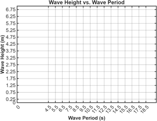{width="90%"}
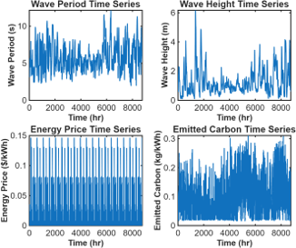{width="90%"}
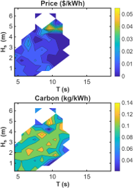{width="90%"}
:::

::: frame
## Preliminary Results: CEM with Reduced Order Dynamics

{width="90%"}
{width="90%"}

- System Cost (\$)

- CO2 Emissions (metric tonnes)

- McCabe, Dietrich, Yang, Long, Kuan, Buccino, Liu, and Haji. "WEC
  optimization to maximize grid economic value and avoided emissions."
  University Marine Energy Community Conference, August 2025, Corvallis
  OR.
:::

::: frame
## Systems Tensions

- System boundary: insight, standardization

- Disciplinary coupling: completeness, complexity

- Model tradeoffs: accuracy, intuition, dev+compute time

- Uncertainty: quantification, interpretation
:::

# Conclusion

::: frame
## Agenda

- Motivation

- Modeling

  - Theory and Implementation

  - Validation and Benchmarking

- Design Optimization: Cost

  - Systems Formulation

  - Results

- Design Optimization: Economic and Environmental Value

  - Metrics and Formulation

  - Preliminary Results

- **Conclusion**
:::

:::: frame
References

::: thebibliography
10

Paper 1 Title. Paper 1 Authors.\
*Journal Name* Edition, Year.

Paper 2 Title. Paper 2 Authors.\
arXiv:1234.56789.
:::
::::

::: frame
## References

- Lehmann, M., Karimpour, F., Goudey, C. A., Jacobson, P. T., and Alam,
  M.-R., 2017. "Ocean wave energy in the united states: Current status
  and future perspectives". Renewable and Sustainable Energy Reviews,
  74, pp. 1300-- 1313.

- LiVecchi, A., Copping, A., Jenne, D., Gorton, A., Preus, R., Gill, G.,
  Robichaud, R., Green, R., Geerlofs, S., Gore, S., Hume, D., McShane,
  W., Schmaus, C., and Spence, H.,2019. Powering the blue economy:
  Exploring opportunities for marine renewable energy in maritime
  markets. Tech. rep., US Department of Energy, Apr.

- Aderinto, T., and Li, H., 2018. "Ocean Wave Energy Converters: Status
  and Challenges". Energies, 11(5), May, p. 1250.

- Agte, J., de Weck, O., Sobieszczanski-Sobieski, J., Arendsen, P.,
  Morris, A., and Spieck, M., 2009. "MDO: Assessment and direction for
  advancement---an opinion of one international group". Structural and
  Multidisciplinary Optimization, 40(1), Apr., p. 17.

- Martins, J. R. R. A., and Lambe, A. B., 2013. "Multidisciplinary
  Design Optimization: A Survey of Architectures". AIAA Journal, 51(9),
  Sept., pp. 2049--2075.

- Al Shami, E., Wang, X., Zhang, R., and Zuo, L., 2019. "A parameter
  study and optimization of two body wave energy converters". Renewable
  Energy, 131, Feb., pp. 1--13.

- Herber, D., 2014. "Dynamic system design optimization of wave energy
  converters utilizing direct transcription". PhD thesis, 05.

- Gaudin, C., David, D. R., Cai, Y., Hansen, J. E., Bransby, M. F.,
  Rijnsdorp, D. P., Lowe, R. J., O'Loughlin, C. D., Lu, T., and Uzielli,
  M., 2021. "From single to multiple wave energy converters: Cost
  reduction through location and configuration optimisation". Final
  Report. The University of Western Australia.

- Goteman, M., Engstr ¨ om, J., Eriksson, M., Isberg, J., and ¨ Leijon,
  M., 2014. "Methods of reducing power fluctuations in wave energy
  parks". Journal of Renewable and Sustainable Energy, 6(4), July, p.
  043103.

- Neary, V. S., Previsic, M., Jepsen, R. A., Lawson, M. J., Yu, Y.-H.,
  Copping, A. E., Fontaine, A. A., Hallett, K. C., and Murray, D.
  K., 2014. Methodology for Design and Economic Analysis of Marine
  Energy Conversion (MEC) Technologies. Tech. Rep. SAND2014-9040, Sandia
  National Laboratories, Albuquerque, New Mexico, Mar.

- Falcao, A. F. d. O., 2010. "Wave energy utilization: A re- ˜ view of
  the technologies". Renewable and Sustainable Energy Reviews, 14(3),
  Apr., pp. 899--918.

- Newman, J. N., 1977. Marine Hydrodynamics. Aug.

- Franklin, G., Powell, J., and Emami-Naeini, A., 2015. "Equivalent Gain
  Analysis Using Frequency Response: Describing Functions". In Feedback
  Control of Dynamic Systems, seventh ed. Pearson, pp. 678--682.

- , 2020. System Advisor Model (SAM). National Renewable Energy
  Laboratory, Nov.

- Paretosearch Algorithm - MATLAB & Simulink.
  https://www.mathworks.com/help/gads/paretosearchalgorithm.html.

- Boretti, A., 2020. "High-frequency standard deviation of the capacity
  factor of renewable energy facilities: Part 1---Solar photovoltaic".
  Energy Storage, 2(1), p. e101.
:::

:::: frame
::: center
Thank you for listening!

Rebecca McCabe\
rgm222@cornell.edu\
:::
::::

::: frame
## Conclusion

- Goal: use early-stage design optimization to find the most viable WEC
  design

- Contribution:

- Techno-economic and environmental metrics reflecting net value to
  system

- Framework to incorporate capacity expansion model in design
  optimization

- Implemented LCOE minimization, achieved 57

- Thorough plan to improve technical modules and extend design space

- Limitations

- Metrics currently do not encompass social impact and certain PBE
  markets

- Price-taker assumption inaccurate for large WEC penetration
:::

::: frame
## Future Work

- Systems architecture (different WEC types, generator designs)

- Robustness and validation
:::

::: frame
## Acknowledgements

- Kapil Khanal, Yinghui Bimali, En Lo, Hope Best, Ruiyang Jiang, Collin
  Treacy, John Fernandez - hydrodynamics

- Alan Liu, Khai Xin Kuan, Kalvinda Parasram, Rumman Jan - capacity
  expansion

- Madison Dietrich, Leah Buccino - environmental

- Madison Dietrich, Anthony Long, Jordan Yang, Iris Ren, Olivia Murphy -
  optimization

- Maha Haji - Principal Investigator, advisor

- Ryan Coe, Jacob Mays, Pat Reed - committee

- Dmitry Savransky, Sam Benson - departmental support

- This material is based upon work supported by the National Science
  Foundation Graduate Research Fellowship under Grant No. DGE--2139899.
  Any opinion, findings, and conclusions or recommendations expressed in
  this material are those of the author and do not necessarily reflect
  the views of the National Science Foundation.

{width="90%"}
:::

# Appendix{appendix=true}

::: frame
## Optimization Process

- Prioritize requirements by model validity

- Enforce high-priority requirements with bounds or linear constraints

- Sequential quadratic programming + pattern search

- Epsilon-constraint seeds to leverage gradients in multi-objective

- McCabe, Dietrich, and Haji. "Leveraging Multidisciplinary Design
  Optimization to Advance Wave Energy Converter Viability." In
  preparation for submission to Renewable Energy.
:::

::: frame
## Reduced Order Model

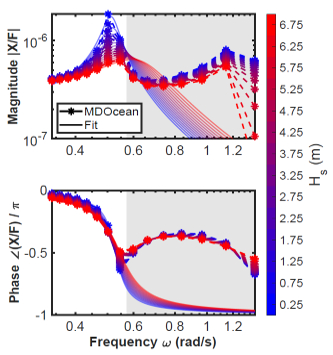{width="90%"}
{width="90%"}

McCabe, Dietrich, Yang, Long, Kuan, Buccino, Liu, and Haji. "WEC
optimization to maximize grid economic value and avoided emissions."
University Marine Energy Community Conference, August 2025, Corvallis
OR.
:::

::: frame
## Environmental: LCA Module

- Eco-Value: carbon emissions avoided from CEM

- Eco-Cost: embodied carbon of steel (dominant), fiberglass, maintenance
  vessel fuel

- Note: if eco-value dominates eco-cost, econ and enviro metrics will
  not conflict

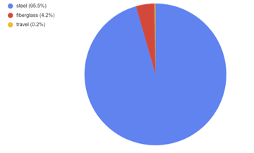{width="90%"}
:::

::: frame
## Grid Capacity Expansion Model

{width="90%"}

McCabe, Dietrich, Yang, Long, Kuan, Buccino, Liu, and Haji. "WEC
optimization to maximize grid economic value and avoided emissions."
University Marine Energy Community Conference, August 2025, Corvallis
OR.
:::

::: frame
## Expected results

- Show trend: CA vs northeast vs grid scenario correlation with sea
  state, and what that means for wec optimization

- Where in the power matrix you prioritize when optimizing cost vs
  value, and econ vs environ, and how this might affect wec design (ie
  decisions of whether to sit out the winter waves / survive them)

- Seasonal complementarity with solar and demand

  - Wec produces when price is high so generates more revenue -
    WEC-level, not system level

  - Wec produces when carbon is high so displaces more fossil fuels -
    WEC-level, not system level

  - Less solar or long-duration energy storage capacity needs to be
    built - system level

- Consistency

  - WEC

  - Less new battery capacity, less usage so longer lifetime of existing
    batteries

- Availability at peak times

  - Reduced system cost and emissions

- Co-location with coastal demand

  - Avoided transmission capacity

- Narrative of wec deciding sea states to survive

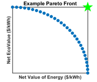{width="90%"}
:::

::: frame
## Electricity Markets by Region

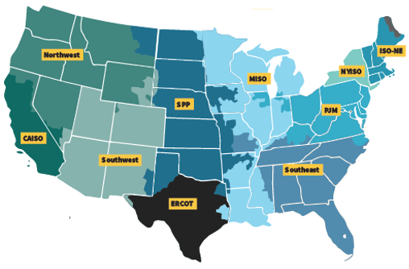{width="90%"}

Image: FERC no capacity markets
:::

::: frame
## What effects are important?

- Utilize other studies for a first-pass model

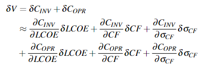{width="90%"}

  Study              1 - Coe et al.                  2 - EVOLVE               3 - de Faria et al.
  ------------------ ------------------------------- ------------------------ ---------------------
  Geographic Scope   California                      UK (Ireland, Portugal)   North Carolina
  Model              Simplified Capacity Expansion   Economic Dispatch        Capacity Expansion
  Parameters         LCOE, CF                        Capacity                 σCF
  Cost               Investment                      Operating                Investment
:::

::: frame
## What effects are important? Capacity cost \>\> operating cost

- Operating costs maximum 4

- Future work: use capacity expansion model to derive weights

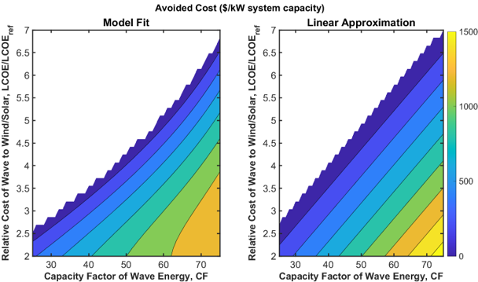{width="90%"}

McCabe, Dietrich, Liu, and Haji, 2023.
:::

::: frame
## Loop Structures

                                                LP Computational Cost                           NLP Computational Cost
  --------------------------------------------- ----------------------------------------------- -------------------------------------------------------------------------------------------
  Current: Reduced order model + lookup table   4D sweep: 104 combos 1 min each Total: 7 days   100 iterations 13 function calls per iteration 50 ms per function call Total: 1 minute
  Possible: price taker assumption              1 min                                           1 min
  Possible: CEM in the loop                     None                                            100 iterations 13 function calls per iteration 1 minute per function call Total: 20 hours
  Possible: single huge CEM                     10 min                                          8D sweep = 108 combos 50 ms per function call Total: 10 weeks
:::

::: frame
## Proposed Process

- Run CEM with no WECs

- Consolidate results w/ ocean data to get marginal cost and carbon vs
  Hs, Te

- Run design optimization to max WEC net value with price taker
  assumption

- Run design optimization to max WEC net value with CEM in the loop

- Run design optimization to max system value with CEM in the loop

- Repeat 1-5 for different grid conditions (location, electrification)

- No ROM, so no RQ4 (how does power matrix affect system value?)
:::

::: frame
## Journal Summary

  \#                        Title                                                                                                               Target Journal               Target submission   Status
  ------------------------- ------------------------------------------------------------------------------------------------------------------- ---------------------------- ------------------- ----------------
  J1 MDOcean modeling       Development, Validation, and Benchmarking of a Multidisciplinary Semi-Analytical Model for Wave Energy Converters   Applied Ocean Research       October 2025        Editing (101p)
  J2 MDOcean optimization   Leveraging Multidisciplinary Design Optimization to Advance Wave Energy Converter Viability                         Renewable Energy             December 2025       Editing (128p)
  J3 MEEM                   Numerics of the matched eigenfunction method for computing wave forces on concentric bodies                         Journal of Fluid Mechanics   December 2025       Drafting
  J4 DECIDER                TBD                                                                                                                 Applied Energy               May 2025            Working
:::

::: frame
## Publication Plan

- Analytical modeling of WECs

  - Hydrodynamics: matched eigenfunction expansion method C6, C7, J3

  - Dynamics: constraints and nonlinearities via describing functions
    C9, J1

  - Structures: stiffened plate model J1

  - Synthesis, validation, and benchmarking C10, C11, J1

- Design optimization of WECs

  - Design for cost: multidisciplinary design optimization C1, C10, J2

  - Design for value: integrated capacity expansion model C2, C5, C11,
    J4

- Side projects (as co-author):

- Aquaculture C3, C4

- WEC prototyping C13, J5

- Carbon sequestration C8, C12

- So far: 13 conferences

- Future: 5 journals
:::

::: frame
## Publications

- McCabe, Khanal, and Haji, "Open-source toolbox for semi-analytical
  hydrodynamic coefficients via the matched eigenfunction expansion
  method," August 2024, UMERC+METS Conference, Duluth MN.

- Best, Khanal, McCabe, Jiang, Treacy, and Haji, "OpenFLASH: An
  open-source flexible library for analytical and semi-analytical
  hydrodynamics calculations," in review for Journal of Open-Source
  Software.

- McCabe, Khanal, Bimali, Lo, Treacy, and Haji, "Numerics of the matched
  eigenfunction method for computing wave forces on concentric bodies,"
  in preparation for submission to Journal of Fluid Mechanics.
:::

::: frame
## Capacity Expansion Model: Global Sensitivity Analysis

- State of world sweep

- \- Demand scenario

- \- Carbon constraint

- \- Wave data year

- \- Location of all data

- Design sweep

- \- D, R, ��m from

- force sat paper

- \- Mode (gain,

- directionality,

- Z(ꞷ) shape)

- \- Cost

- GenX CEM run for 2030, 40, 50

- Capacity wave built

- System cost avoided

- Carbon emissions avoided

- Surrogate model, robustness evaluation

- Sweep strategy: full factorial, but one-at-a-time on wave data year
:::

::: frame
## Question 2 (Jacob): CEM Econ Interaction

- CEM

- Cost model

- Design

- Max cost for viability

- Modeled cost

- Cost leftover for unmodeled components

- Ignore CEM outputs, never flat, no cost assumption

- CEM

- Cost model

- Design

- Avoided system cost for each WEC cost

- Modeled cost

- Cost estimate for unmodeled components

- Uses CEM outputs, flat, cost assumption

- Avoided system cost
:::

::: frame
## Describing Functions

- Analytical expression for fundamental harmonic

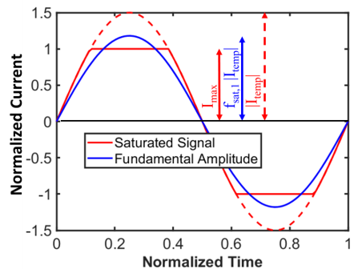{width="90%"}
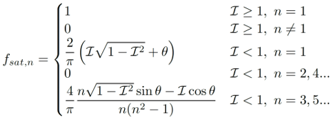{width="90%"}

McCabe and Haji, "Force-Limited Control of Wave Energy Converters using
a Describing Function Linearization," September 2024, IFAC CAMS
Conference, Blacksburg VA.
:::

::: frame
## MEEM Computational Results: Runtime, Convergence

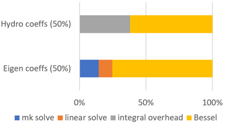{width="90%"}
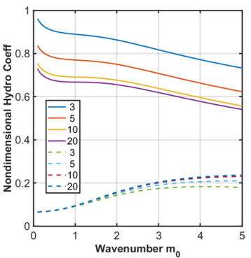{width="90%"}
:::

::: frame
## MEEM equations and setup

{width="90%"}

- A-matrix sparsity for N=M=K=4

- N

- M

- M

- K

- N M M K

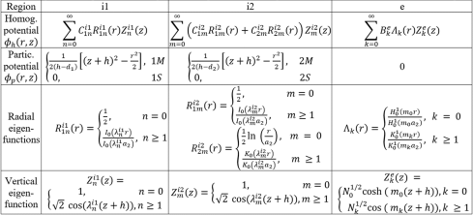{width="90%"}
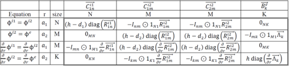{width="90%"}
:::

::: frame
## Visualizing Amplitude Constraints on Smith Chart

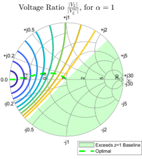{width="90%"}
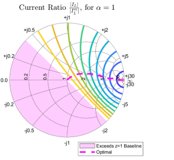{width="90%"}
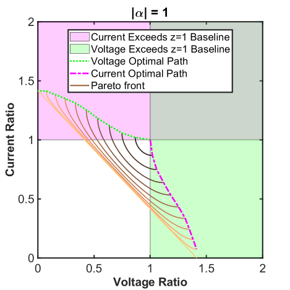{width="90%"}
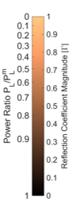{width="90%"}
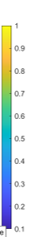{width="90%"}
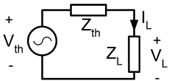{width="90%"}
:::

::: frame
## Describing Function Block Diagram

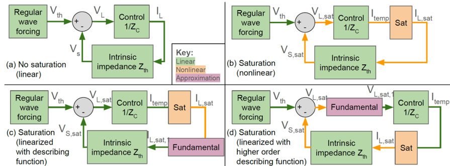{width="90%"}
:::

::: frame
## A-Exam Slides
:::

::: frame
## Agenda

- Motivation

- Techno-Economic and Environmental Metrics

  - Metric selection

  - Metric weighting

  - Optimization framework

- Design Optimization

  - V1 formulation and results

  - V2 formulation

  - V3 concept

- Conclusion
:::

::: frame
## Future Design Optimization Features

  Version   Hydro Coefficients               Controls                                               Storage   Objective                Architecture
  --------- -------------------------------- ------------------------------------------------------ --------- ------------------------ --------------
  V1        Long wave approximation          Same for all sea states, linear with saturation        No        LCOE and cv              RM3 only
  V2        Analytical PDE solution          Different for each sea state, linear with saturation   Yes       LCOE and cv              RM3 only
  V3        Boundary element method solver   WecOptTool, nonlinear                                  Yes       NVOE and net eco-value   Various
:::

::: frame
## V2 - Improved Analytical Hydrodynamic Coefficients

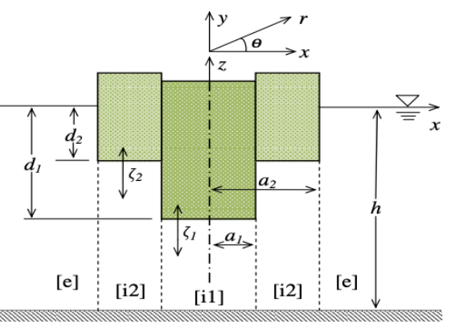{width="90%"}

- Laplace's equation

- PDE boundary conditions

- Matched eigenfunction method

- Symbolic, differentiable

- Faster than BEM, no approximations

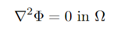{width="90%"}

Chau and Yeung, 2010.
:::

::: frame
## V2 - Energy Storage

- Can WEC design reduce power variability more effectively than energy
  storage?

- Generate power probability density function without storage

- Account for storage with a given power limit

- Account for storage with a given energy capacity

- Calculate the impact on cost and power variation

- Compare to pareto front without storage

- McCabe, Murphy, and Haji, 2022.
:::

::: frame
## V3 Concept

- Bi-level optimization, enhanced control co-design

{width="90%"}
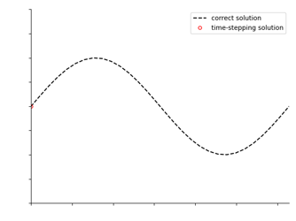{width="90%"}
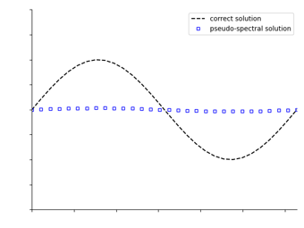{width="90%"}
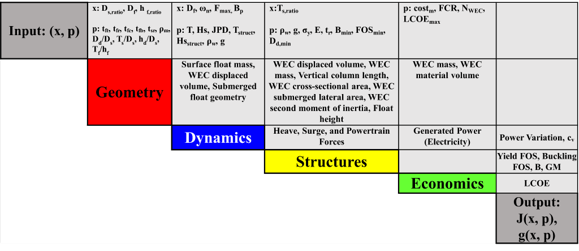{width="90%"}

- Internal optimization with WecOptTool

- DV: WEC response and powertrain force harmonics

- Objective: power (convex) or cost (nonconvex)

- \+ Environment
:::

::: frame
## Agenda

- Motivation

- Techno-Economic and Environmental Metrics

  - Metric selection

  - Metric weighting

  - Optimization framework

- Design Optimization

  - V1 formulation and results

  - V2 formulation

  - V3 concept

- Conclusion
:::

::: frame
## Conference Papers and Presentations

- Khanal, McCabe, and Haji, "Gradient-based Design Optimization of
  Concentric Cylindrical Offshore Structures," 2023. SIAM Conference on
  Optimization. Accepted.

- McCabe, Dietrich, Liu, and Haji, 2023. "System Level Techno-Economic
  and Environmental Design Optimization for Ocean Wave Energy." ASME
  IDETC-CIE: Design Automation Conference. In Press.

- Hasankhani, McCabe, Ewig, Won, and Haji, 2023. "Design of a
  Wave-Powered Aquaculture Farm," International Ocean and Polar
  Engineering Conference. In Press.

- Hasankhani, Ewig, McCabe, Won, and Haji, 2023. "Marine Spatial
  Planning of a Wave-Powered Offshore Aquaculture Farm in the Northeast
  U.S." IEEE Oceans Conference -- Limerick. In Press.

- McCabe and Haji, 2022, "Value Metrics and Global Impact Potential of
  Wave Energy," University Marine Energy Research Community Conference.

- McCabe, Murphy, and Haji, 2022, "Multidisciplinary Optimization to
  Reduce Cost and Power Variation of a Wave Energy Converter," ASME
  IDETC-CIE: Design Automation Conference.
  https://doi.org/10.1115/DETC2022-90227.
:::

::: frame
## Backup Slides
:::

::: frame
## Metric Weighting - Grid Scale - Study 1

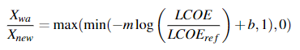{width="90%"}
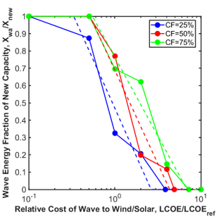{width="90%"}
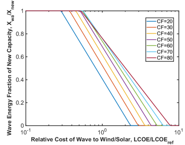{width="90%"}
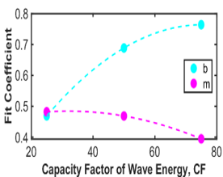{width="90%"}
:::

::: frame
## Metric Weighting - Grid Scale - Study 2

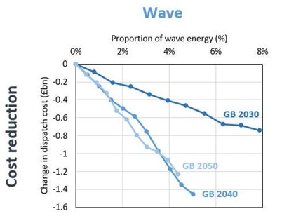{width="90%"}
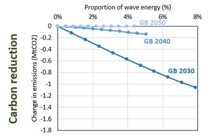{width="90%"}
:::

::: frame
## Metric Weighting - Grid Scale - Study 3

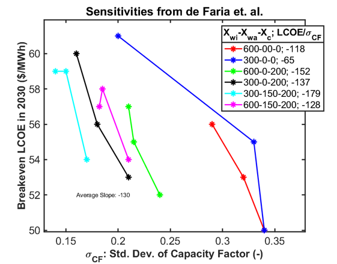{width="90%"}
:::

::: frame
## Metric Selection

  Temporal value   Consistency                         Technical                                  Economic                           Environmental                 Operational
  ---------------- ----------------------------------- ------------------------------------------ ---------------------------------- ----------------------------- -----------------------------------
  Availability     Coefficient of variation of power   Capture width (ratio)                      Levelized cost (value) of energy   Net EcoCosts                  Manufacturability
  Persistence      Capacity factor                     Technology readiness (performance) level   Payback period                     Global warming potential      Deployability and maintainability
  Versatility      Force peak to average ratio         Hydrodynamic performance quality           Internal rate of return            Energy return on investment   Robustness to uncertainty
:::

::: frame
## Optimization - Dealing with Categorical Variables

- Separate gradient-based optimization for each integer combination

- Nested gradient-based solver inside a heuristic solver

- MINLP solver: AMIEGO, APOPT, Baron, Couenne, Bonmin, mindtPy

  - Only AMIEGO has been used with OpenMDAO

  - Others available from pyomo and Gekko packages

- Decreasing computational cost

- Increasing implementation complexity
:::

::: frame
## Optimization - Making it Multiobjective

- Construct the pareto front with a sequence of single-objective
  optimizations

  - Normal boundary intersection method to generate evenly spaced points
    for nonconvex part of the pareto front

- Use the above method to generate a few points, and use those as
  initial population in MOGA or similar

- Fancy research algorithms for inherently gradient-based multiobjective
  optimization

  - Not available in python packages

- Decreasing computational cost

- Increasing implementation complexity
:::

:::: frame
## Optimization Convergence and Global Minimum

- 100 random initial designs

- Of the  40

::: tabular
\|l\|l\| LCOE minimization & 67 Cv minimization & 98
:::
::::

::: frame
## Modeling and Simulation

- Device Power Capability \* Site Wave Data = Power Production

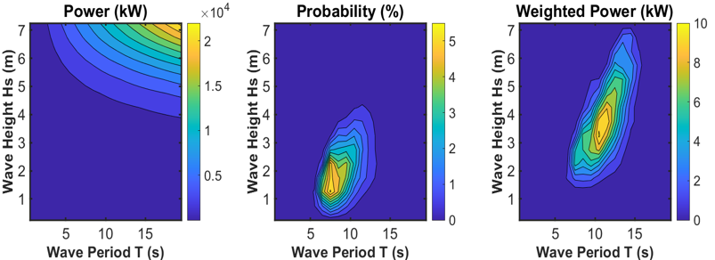{width="90%"}

- JPD for Humboldt, CA

- From Simulation
:::

::: frame
## Power Distribution Comparison

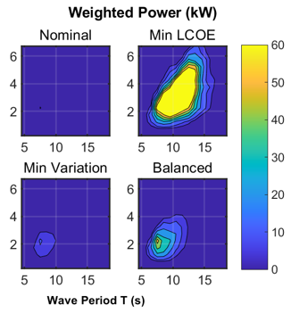{width="90%"}
:::

::: frame
## Matched Eigenfunction Method - Boundary Value

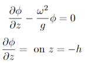{width="90%"}
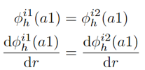{width="90%"}
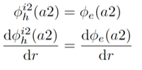{width="90%"}
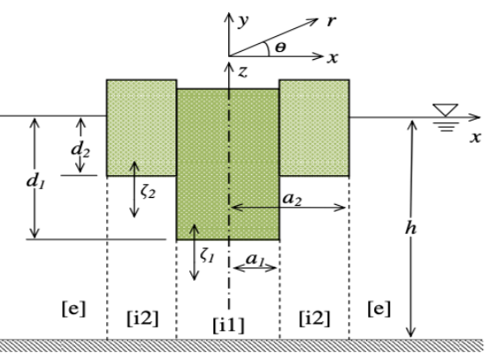{width="90%"}
:::

::: frame
## Conference Papers and Presentations

- Khanal, McCabe, and Haji, "Gradient-based Design Optimization of
  Concentric Cylindrical Offshore Structures," 2023. SIAM Conference on
  Optimization. Accepted.

- (McCabe et al. 2023)

- Hasankhani, McCabe, Ewig, Won, and Haji, 2023. "Design of a
  Wave-Powered Aquaculture Farm," International Ocean and Polar
  Engineering Conference. In Press.

- Hasankhani, Ewig, McCabe, Won, and Haji, 2023. "Marine Spatial
  Planning of a Wave-Powered Offshore Aquaculture Farm in the Northeast
  U.S." IEEE Oceans Conference -- Limerick. In Press.

- (McCabe et al. 2022)

- (McCabe et al. 2022)
:::

::: frame
## Backup Slides
:::

::: frame
## Metric Weighting - Grid Scale - Study 1

{width="90%"}
{width="90%"}
{width="90%"}
{width="90%"}
:::

::: frame
## Metric Weighting - Grid Scale - Study 2

{width="90%"}
{width="90%"}
:::

::: frame
## Metric Weighting - Grid Scale - Study 3

{width="90%"}
:::

::: frame
## Metric Selection

  Temporal value   Consistency                         Technical                                  Economic                           Environmental                 Operational
  ---------------- ----------------------------------- ------------------------------------------ ---------------------------------- ----------------------------- -----------------------------------
  Availability     Coefficient of variation of power   Capture width (ratio)                      Levelized cost (value) of energy   Net EcoCosts                  Manufacturability
  Persistence      Capacity factor                     Technology readiness (performance) level   Payback period                     Global warming potential      Deployability and maintainability
  Versatility      Force peak to average ratio         Hydrodynamic performance quality           Internal rate of return            Energy return on investment   Robustness to uncertainty
:::

::: frame
## Optimization - Dealing with Categorical Variables

- Separate gradient-based optimization for each integer combination

- Nested gradient-based solver inside a heuristic solver

- MINLP solver: AMIEGO, APOPT, Baron, Couenne, Bonmin, mindtPy

  - Only AMIEGO has been used with OpenMDAO

  - Others available from pyomo and Gekko packages

- Decreasing computational cost

- Increasing implementation complexity
:::

::: frame
## Optimization - Making it Multiobjective

- Construct the pareto front with a sequence of single-objective
  optimizations

  - Normal boundary intersection method to generate evenly spaced points
    for nonconvex part of the pareto front

- Use the above method to generate a few points, and use those as
  initial population in MOGA or similar

- Fancy research algorithms for inherently gradient-based multiobjective
  optimization

  - Not available in python packages

- Decreasing computational cost

- Increasing implementation complexity
:::

::: frame
## Optimization Convergence and Global Minimum

- 100 random initial designs

- Of the  40% that converged with the KKT conditions satisfied, how many
  found the best local optimum?

  LCOE minimization   67%
  ------------------- -----
  Cv minimization     98%
:::

::: frame
## Modeling and Simulation

- Device Power Capability \* Site Wave Data = Power Production

{width="90%"}

- JPD for Humboldt, CA

- From Simulation
:::

::: frame
## Power Distribution Comparison

{width="90%"}
:::

::: frame
## Matched Eigenfunction Method - Boundary Value

{width="90%"}
{width="90%"}
{width="90%"}
{width="90%"}
:::

::::: {#refs .references .csl-bib-body .hanging-indent}
::: {#ref-mccabe_system_2023 .csl-entry}
McCabe, Rebecca, Madison Dietrich, Alan Liu, and Maha Haji. 2023.
"System Level Techno-Economic and Environmental Design Optimization for
Ocean Wave Energy." (Boston, MA, USA), August.
:::

::: {#ref-mccabe_multidisciplinary_2022 .csl-entry}
McCabe, Rebecca, Olivia Murphy, and Maha Haji. 2022. "Multidisciplinary
Optimization to Reduce Cost and Power Variation of a Wave Energy
Converter." *ASME 2022 International Design Engineering Technical
Conferences and Computers and Information in Engineering Conference*,
November, 10. <https://doi.org/10.1115/DETC2022-90227>.
:::
:::::
